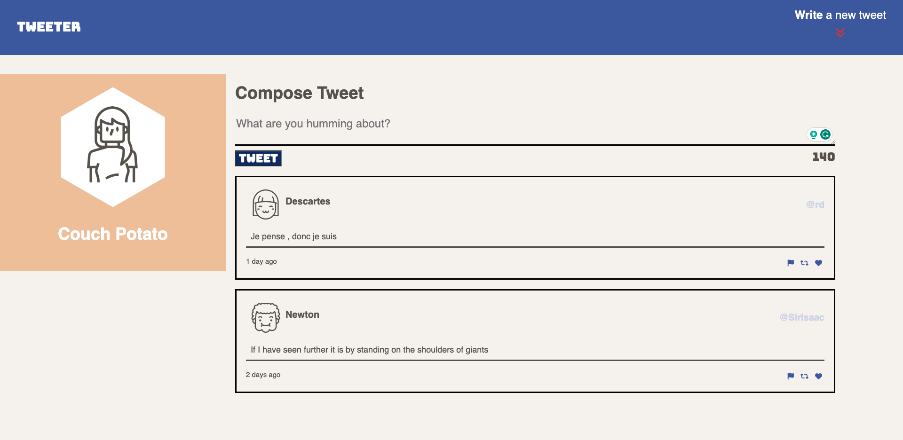
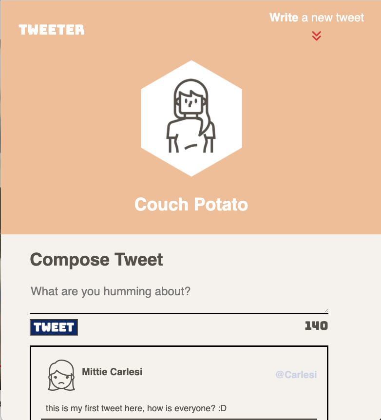

# Tweeter Project

Tweeter is a simple, single-page Twitter clone.

This app provides the user with the ability to post tweets to a Tweet feed. This app was built with Javascript, jQuery, AJAX on the front-end, and with Express and Node on the back-end. The contents of the app were built using HTML and CSS styling.

# Core Features
* Start by writing a tweet in the tweet box and clicking on "Tweet". This will "Submit" the tweet to the back-end via AJAX.
* A successful POST request will then GET the tweet object back from the back-end and update the feed without having to refresh the page.
* Error messages will be displayed if an empty tweet or a tweet longer than 140 characters is being submitted.
* This app uses a responsive design and will adjust depending on the display size.

# How it looks like

## Getting Started

1. [Create](https://docs.github.com/en/repositories/creating-and-managing-repositories/creating-a-repository-from-a-template) a new repository using this repository as a template.
2. Clone your repository onto your local device.
3. Install dependencies using the `npm install` command.
3. Start the web server using the `npm run local` command. The app will be served at <http://localhost:8080/>.
4. Go to <http://localhost:8080/> in your browser.

## Dependencies

- Express
- Node 5.10.x or above